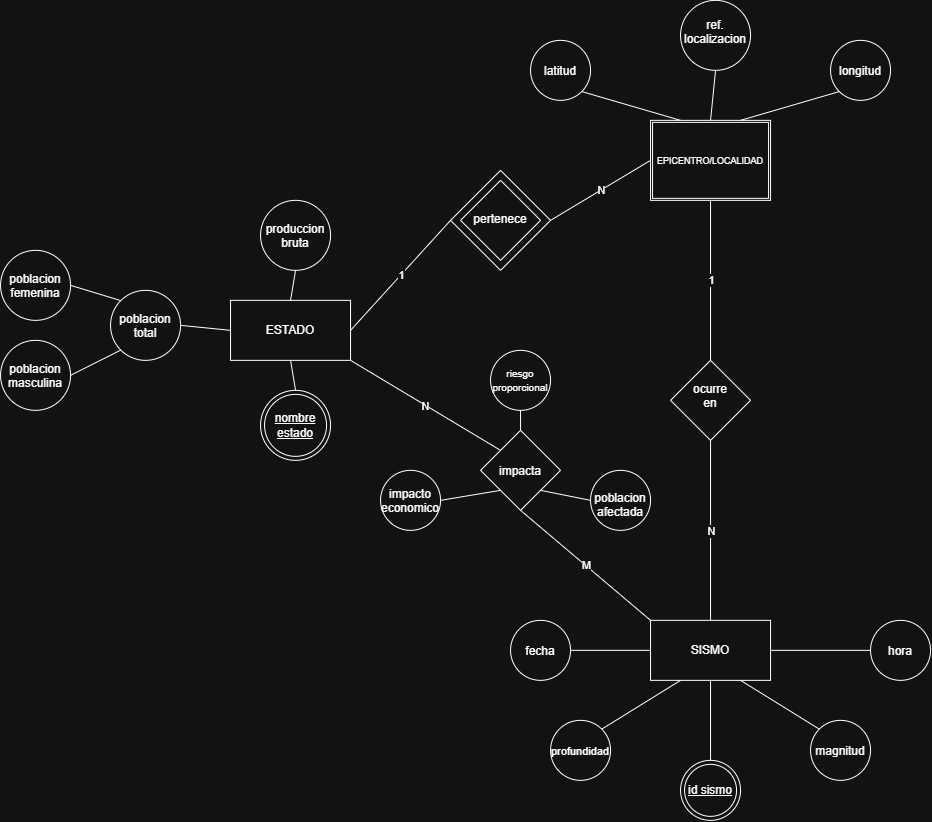

# Ejercicio 5
**Identificacion y Justificacion de la Entidad Debil:** 
- Entidad identificada: 'EPICENTRO/LOCALIDAD'
- Justificacion: Para que esta exista lógicamente en el dominio, depende de la entidad fuerte 'ESTADO' a traves de la relacion identificadora 'pertenece', el atributo clave de esta entidad es 'ref.localización' el cual se refiere al nombre de algun municipio pero este no es suficiente para identificar el lugar de forma univoca a nivel nacional ya que puede repetirse en distintos lugares.

