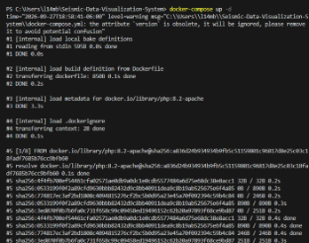
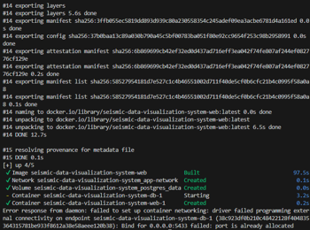
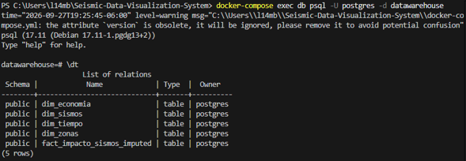
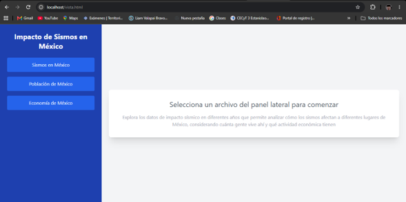

# Evidencia de Levantamiento del Sistema

## 1. Despliegue de Contenedores
Se ejecuto el comando 'docker-compose up -d' en la raiz del proyecto.
* **Evidencia:** 

## 2. Configuracion de Base de Datos y Datos Iniciales
De acuedo con la documentacion se requeria configurar PostgreSQL e importar datos, los cuales al analizar el archivo 'docker-compose.yml' podemos ver que los procesos se automatizan. 
Comprobamos la existencia de las bases de datos ingresandodirectamente al contenedor. 
* **Evidencia:** 

## 3. Acceso a la Interfaz Web
**Nota:** Al intentar acceder a la ruta raiz ('http://localhost') el servidor arrojó un error, revisando los archivos dentro de ('./src'), vimos que no existe un 'index.html' sino 'vista.html'.
Para solucionar el problema y visualizar el sistema a la ruta se agrego 'http//localhost/vista.html'.
* **Evidencia:** 

